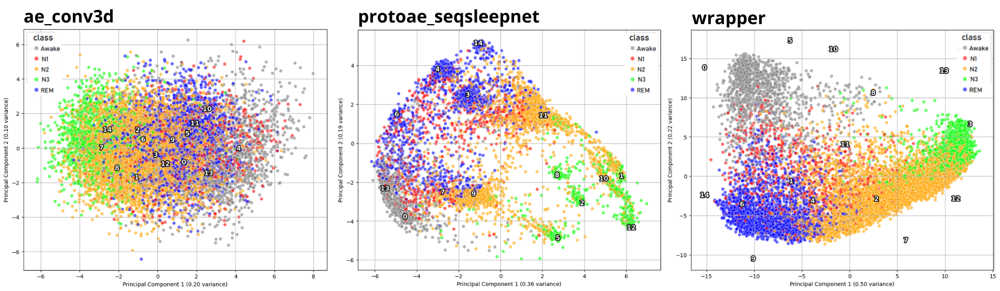

# Concept Learning

The concept idea revolves around enhancing the interpretability and reasoning capabilities of deep learning models. By associating data points with high-level, interpretable concepts, we can gain insights into the model's decision-making process. This approach can help identify areas for improvement and ensure that the model's predictions align with human reasoning.  
Currently, we lack datasets that include predefined concept labels. To address this, we aim to extend existing datasets by automatically annotating them with high-level, interpretable concepts. The idea is to create a method that can generate embeddings of records that capture time-frequency behaviors. The goal is to extract prototypes that are representative of concepts. Finally, the intention is to assign conceptual activations to records in a dataset based on their distance from prototypes in the latent space.

In this library, several methods for concept extraction are implemented in `train/networks`, divided into three main categories:
- AutoEncoder: AutoEncoderFullyConnected, AutoEncoderConv3D, AutoEncoderSeqSleepNet
- ProtoAutoEncoder: PrototypeAESeqSleepNet
- Wrapper: SeqSleepNet

The first two methods extend the `SelfSupervisedSleepModule` class, which in turn extends `SleepModule`, while the last one is an approach that encapsulates a classification model that simply extends `SleepModule`. Consequently, all these models can be trained using the same criteria applied to any model that inherits from the `SleepModule` class.

The ProtoAutoEncoder type is the one with the best results, as can also be seen from the distributions of the prototypes and record embeddings.



Once the model for creating embeddings and prototypes is trained, it can be used for labeling. A `ProtoAESeqSleepNet` trained model is provided, it has been trained on a combination of datasets, including SHHS, MASS, DCSM, MROS, MESA, and HMC, to enable robust concept extraction across a variety of data sources. The checkpoint is located in `train/models/checkpoints` and `train/models/backup` folder.

## Concept Labeling
The `ConceptLabeler` class is designed to facilitate the process of concept labeling in a dataset. It utilizes a neural network model for generating concept embeddings based on the input data. The class is initialized with several parameters that define the dataset, model, and configuration required for labeling. The main functionalities include computing distances between data embeddings and model prototypes, as well as deriving concept activations based on those distances.

# Class Documentation
`ConceptLabeler`
::: explain.concepts.ConceptLabeler
    handler: python
    options:
      members:
        - __init__
        - run
      show_root_heading: false
      show_source: false
	  heading_level: 3

---
---

The following describes with an example how to define a model class and its configuration parameters, set up a datamodule, create an instance of the `ConceptLabeler` and run it.

#### Define the Model Class and Its Configuration Parameters
First, you need to select the model to use for concept labeling. In this case, we will use `PrototypeAESeqSleepNet`. The following code snippet demonstrates how to import the model class:

```python
import os
import importlib

# Define the model class to use for concept labeling, in this case the PrototypeAESeqSleepNet
model_class = "physioex.train.networks.protoae_seqsleepnet:PrototypeAESeqSleepNet"
module_name, class_name = model_class.split(":")
model_class = getattr(importlib.import_module(module_name), class_name)
```
Next, define the datamodule that will be used to load the dataset you want to extend with concepts:

```python
from physioex.train.networks import config as networks_config

model_config = networks_config["default"]["model_kwargs"].copy()
datamodule_kwargs = {
    "selected_channels": ["EEG"],
    "sequence_length": 3,
    "target_transform": None,  # needs to match model output
    "preprocessing": "xsleepnet",  # needs to match model input
    "data_folder": "/data/data_folder/",  # your custom path here
    "num_workers": os.cpu_count(),  # default value
}

# Now setup the ones that depend on the datamodule
model_config.update({
    "in_channels": len(datamodule_kwargs["selected_channels"]),
    "sequence_length": datamodule_kwargs["sequence_length"],
})
```

#### Create an Instance of the Concept Labeler
Now, create an instance of the `ConceptLabeler` using your chosen model and datamodule. Execute it with the `run` method:
```python
from physioex.explain.concepts.concept_labeler import ConceptLabeler

concept_labeler = ConceptLabeler(
    dataset_name="mass",
    data_folder="mnt/guido-data/",
    model_class=model_class,
    model_config=model_config,
    model_ckpt_path="physioex_folder/physioex/train/models/checkpoints/protoae_ssn-EEG-L=3-val_loss=5.42.ckpt",
    channels_index=[0],
    sequence_length=3
)

concept_labeler.run()
```

Define the model class and its configuration parameters:
```python
import os
import importlib

# Select the model to use for concept labeling, in this case the PrototypeAESeqSleepNet
model_class = "physioex.train.networks.protoae_seqsleepnet:PrototypeAESeqSleepNet"
module_name, class_name = model_class.split(":")
model_class = getattr(importlib.import_module(module_name), class_name)
```

Define the datamodule that will be used to load the dataset you want to extend with concepts, in this case :

```python
from physioex.train.networks import config as networks_config

model_config = networks_config["default"]["model_kwargs"].copy()
datamodule_kwargs = {
    "selected_channels": ["EEG"],
    "sequence_length": 3,
    "target_transform": None,  # needs to match model output
    "preprocessing": "xsleepnet",  # needs to match model input
    "data_folder": "/data/data_folder/",  # your custom path here
}

# Now setup the ones that depend on the datamodule
model_config.update({
    "in_channels": len(datamodule_kwargs["selected_channels"]),
    "sequence_length": datamodule_kwargs["sequence_length"],
})
```
Create an instance of the concept labeler using your chosen model and datamodule, then execute it with the `run` method:

```python
from physioex.explain.concepts.concept_labeler import ConceptLabeler

concept_labeler = ConceptLabeler(
    dataset_name="mass",
    data_folder="data/data_folder/",
    model_class=model_class,
    model_config=model_config,
    model_ckpt_path="physioex/train/models/checkpoints/protoae_ssn-EEG-L=3-val_loss=5.42.ckpt",
    channels_index=[0],
    sequence_length=3
)

concept_labeler.run()
```

---
---
